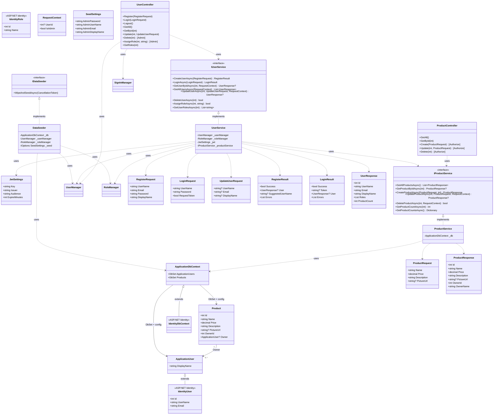
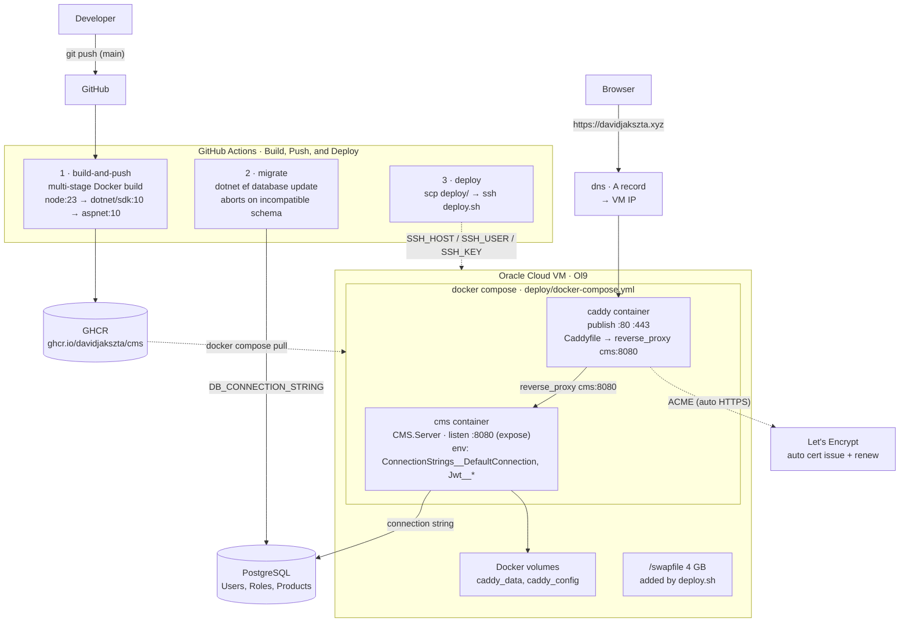

# CMS

A full-stack content management system with a self-hosted, fully automated deployment. Live at <https://davidjakszta.xyz>.
In this case Users can manage products and connect with other users. The system is built architecturally so that more products and categories can be easily implemented.

This project started as a personal learning journey and grew into a production system that I build, ship, and operate end-to-end. It is not just a CMS — it is a complete example of modern full-stack development, from database to HTTPS.

## Why this project

- Learn how a modern web application is built from scratch, backend and frontend.
- Learn to ship software the way it is done in industry: containerized, tested in a pipeline, deployed automatically.
- End up with a real, working product I can point to — not a tutorial to-do app.

---

## Backend

ASP.NET Core (RESTful API with CRUD operations) — `.NET 10`, `CMS.Server/`

### Relational Databases & ORM
- Learned **relational database concepts** hands-on with **PostgreSQL** (tables, keys, relationships, normalization).
- **Entity Framework Core** is the **ORM** connecting the application to the database via a `DbContext` — working with C# objects instead of raw SQL.
- **Dependency Injection** is used throughout the API layer — services are registered once in `Program.cs` (e.g. `IUserService` → `UserService`) and injected where needed.
- **Migrations** manage the schema and evolve it safely — including a **Role model** for authorization.
- **ASP.NET Core Identity** provides users, roles, and password hashing out of the box.
- Learned **asynchronous programming** in practice: async/await through database interactions (EF Core `ToArrayAsync`/`SaveChangesAsync`) and the web requests from the frontend (Angular `HttpClient` observables).

### RESTful API with CRUD
- Built with the **MVC architecture**, exposing a **RESTful API with CRUD operations** (`UserController`): create (register), read, update, delete.
- *(Note: CRUD and RESTful are not the same — CRUD is the set of operations, REST is the architectural style used to expose them over HTTP.)*

### Authentication & Authorization
The API serves two kinds of clients, and authenticates both:

- **JWT bearer tokens** for B2B / non-browser clients — stateless, machine-to-machine.
- **Cookie authentication** (ASP.NET Core Identity, HTTP-only, SameSite=Strict, Secure) for browser users.

A single **default authorization policy accepts both schemes**, so endpoints can be protected once and used by either client type. **Role-based authorization** restricts admin operations (`[Authorize(Roles = "Admin")]`).

## Frontend

Angular — `cms.client/`

- Built with the **Angular module system** (components, modules, and their dependency wiring).
- A set of **reusable Angular components** shared across the app instead of duplicated UI logic.
- **Services** encapsulate API calls and state; Angular's **DI container** injects them where needed.
- A **JWT HTTP interceptor** transparently attaches the auth token to every outgoing request — no manual header handling in components.

## DevOps, CI/CD & Deployment

`deploy/` + `.github/workflows/deploy.yml`

### Continuous Integration Pipeline (GitHub Actions)
On every push to `main` the pipeline:

1. **Containerizes** the application (multi-stage Docker build) and pushes the image to **GHCR** (GitHub Container Registry) — runnable in any environment.
2. **Runs database migrations** against the production database. If the schema is incompatible, the pipeline **aborts** and uploads the **migration log as a build artifact** so the developer can see exactly what failed.
3. **Deploys over SSH** to a Linux VM: downloads the image, pulls the new config, and starts the application.

### Infrastructure
- **Docker Compose** runs the app and the reverse proxy as containers.
- **Caddy** acts as a reverse proxy and handles **automatic HTTPS with automatic certificate issuance and renewal** — the developer never touches certificates.
- The developer can now **focus on code, not deployment**: shipping is a `git push`.
- The deployment target is easy to change — point a few **GitHub secrets / environment variables** (`SSH_HOST`, `SSH_USER`, `SSH_KEY`, connection strings, JWT keys) at a new machine and the same pipeline deploys there.

## Testing

Automatic test suites (unit/integration tests for the backend, component tests for the frontend) are a top priority — they catch regressions before they ever reach production and make the pipeline trustworthy. They are planned and will be implemented as the next step in the CI pipeline as time allows.

## Repository layout

| Path             | What it is                                  |
| ---------------- | ------------------------------------------- |
| `CMS.Server/`    | ASP.NET Core backend (REST API, EF Core, Identity) |
| `cms.client/`    | Angular frontend                            |
| `deploy/`        | Docker Compose, Caddyfile, deploy script    |
| `.github/workflows/` | CI/CD pipeline                          |
| `Dockerfile`     | Multi-stage container build                 |

## Running locally

See `cms.client/README.md` and the project's `CHANGELOG` files for setup details.

---

## Architecture (UML)

The system has three layers: the Angular frontend, the ASP.NET Core API, and the containerized deployment on an Oracle Cloud VM.

### Backend class diagram

### Frontend component diagram

```mermaid
classDiagram
    direction TB

    class AppModule {
        <<NgModule>>
        +declares App, Navbar, Pagination, Modal, PriceFilter, all pages
        +imports BrowserModule, HttpClientModule, FormsModule, AppRoutingModule
    }
    class App {
        <<root component>>
        +App.html : Navbar + RouterOutlet
    }
    class AppRoutingModule {
        <<routes>>
        +"", login, register, profile, users, users/:id
        +products, products/new, products/:id, products/:id/edit, admin
    }

    AppModule --> App : bootstrap
    AppModule --> AppRoutingModule : imports
    App --> AppRoutingModule : RouterOutlet

    class Navbar
    class Pagination
    class Modal
    class PriceFilter

    class Home
    class Login
    class Register
    class Profile
    class Users
    class UserProfile
    class Admin
    class ProductList
    class ProductDetail
    class ProductForm

    class AuthGuard {
        <<guard>>
    }
    class AdminGuard {
        <<guard>>
    }

    class AuthService {
        +login(LoginRequest) Observable~LoginResult~
        +register(RegisterRequest) Observable~UserResponse~
        +logout()
        +getCurrentUser() UserResponse?
        +isAuthenticated() bool
        +isAdmin() bool
    }
    class UserService {
        +getAll() Observable~UserResponse[]~
        +getById(int) Observable~UserResponse~
        +update(int, UpdateUserRequest) Observable~UserResponse~
        +delete(int) Observable~void~
        +assignRole(int, string) Observable~any~
        +getRoles(int) Observable~string[]~
    }
    class ProductService {
        +getAll() Observable~ProductResponse[]~
        +getById(int) Observable~ProductResponse~
        +create(ProductRequest) Observable~ProductResponse~
        +update(int, ProductRequest) Observable~ProductResponse~
        +delete(int) Observable~void~
    }
    class HttpClient {
        <<@angular/common/http>>
    }

    App --> Navbar : contains
    ProductList --> PriceFilter : uses
    ProductList --> Pagination : uses
    Users --> Pagination : uses
    ProductDetail --> Modal : uses

    Login ..> AuthService : uses
    Register ..> AuthService : uses
    Profile ..> AuthService : uses
    Profile ..> UserService : uses
    Users ..> UserService : uses
    UserProfile ..> UserService : uses
    UserProfile ..> ProductService : uses
    Admin ..> UserService : uses
    Admin ..> AuthService : uses
    ProductList ..> ProductService : uses
    ProductDetail ..> ProductService : uses
    ProductForm ..> ProductService : uses
    Home ..> AuthService : uses

    AuthGuard ..> AuthService : checks
    AdminGuard ..> AuthService : checks

    AuthService ..> HttpClient : uses
    UserService ..> HttpClient : uses
    ProductService ..> HttpClient : uses
```

The frontend models (`login-request`, `login-result`, `register-request`, `register-result`, `user-response`, `update-user-request`, `product-request`, `product-response`) mirror the backend DTOs and are shared by the services above.

### Infrastructure diagram

### Infrastructure components

| Component | Role | Where it lives |
| --------- | ---- | -------------- |
| **GitHub Actions** | Runs the CI/CD pipeline on every push to `main`: build & push image, run migrations, deploy | `.github/workflows/deploy.yml` |
| **GHCR** | Container registry hosting `ghcr.io/davidjakszta/cms` | `Dockerfile` (multi-stage build) |
| **Oracle Cloud VM** | Single Linux VM (Ol9) running the app via Docker Compose | `deploy/` |
| **Docker Compose** | Orchestrates the `cms` and `caddy` containers on a shared bridge network `cms-network` | `deploy/docker-compose.yml` |
| **CMS container** | ASP.NET Core app + Angular static files; listens on `:8080` (internal only) | image built by `Dockerfile` |
| **Caddy** | Reverse proxy, automatic HTTPS, auto-issued/renewed certificates; publishes `:80`/`:443` | `deploy/Caddyfile` |
| **PostgreSQL** | Relational database referenced via connection string (not a Compose service) | managed externally |
| **Docker volumes** | Persist Caddy data/certs across container restarts | `caddy_data`, `caddy_config` |
| **Swap file** | 4 GB `/swapfile` created by the deploy script (free tier VM has ~500 MB RAM) | `deploy.sh` |
| **DNS** | `davidjakszta.xyz` → VM IP | domain provider |
